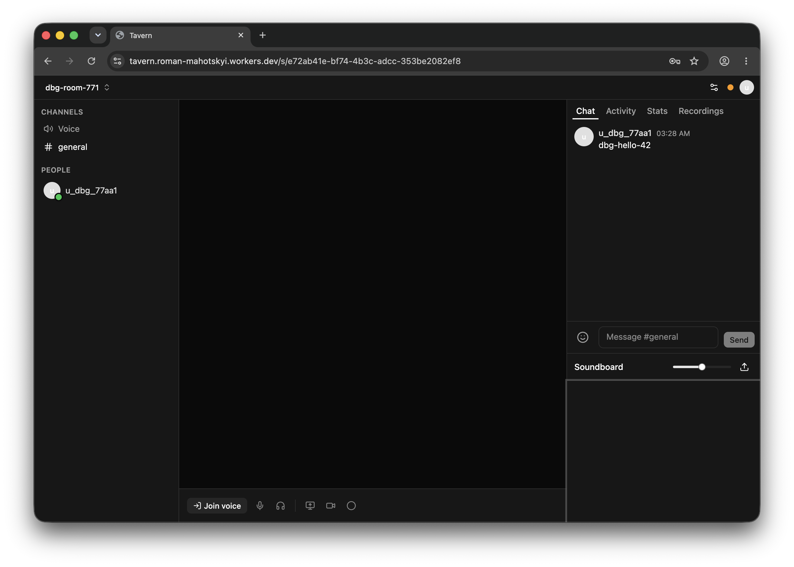

# Tavern

A cozy little hangout for a small group of friends — voice chat, text channels, screen sharing,
and a soundboard, all in one place.

## License

MIT — free to use, just keep the author credit. See [LICENSE](LICENSE).

Built by [Roman Mahotskyi](https://github.com/enheit).

---

Want to run or contribute to Tavern? See [docs/DEVELOPMENT.md](docs/DEVELOPMENT.md).
