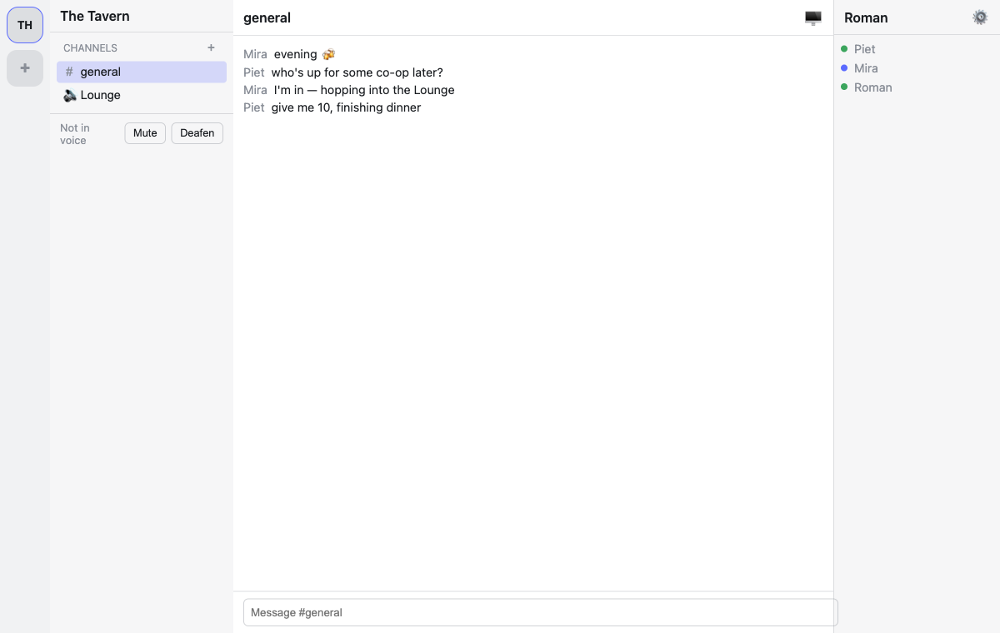

# Tavern 🍻

A tiny, performance-first Discord-style desktop app for a small group of friends.
Native Rust media engine (libwebrtc), Svelte 5 UI in a Tauri 2 shell, and a
Cloudflare-only backend (Workers + Durable Objects + D1 + R2 + Realtime SFU).



## Features

- Servers → channels → group text chat, with presence (offline / online / in voice)
- Voice channels: mute, deafen, per-user volume, speaking rings (echo-cancelled via libwebrtc APM)
- Screen share + webcam with resolution/fps pickers, simulcast, watch-multiple + pin
- Password-locked channels, editable nickname / color / avatar, light/dark/system theme
- Self-updating builds for macOS, Windows, Linux

## Development

```sh
pnpm install
pnpm dev:worker   # local Cloudflare stack (wrangler dev, port 8787)
pnpm tauri dev    # the desktop app
pnpm test         # app + worker suites; `cargo test --workspace` for the Rust side
```

Docs: [`docs/PLAN.md`](docs/PLAN.md) (implementation plan),
[`docs/progress.md`](docs/progress.md) (step-by-step evidence log),
[`docs/release.md`](docs/release.md) (signing + publishing updates).
